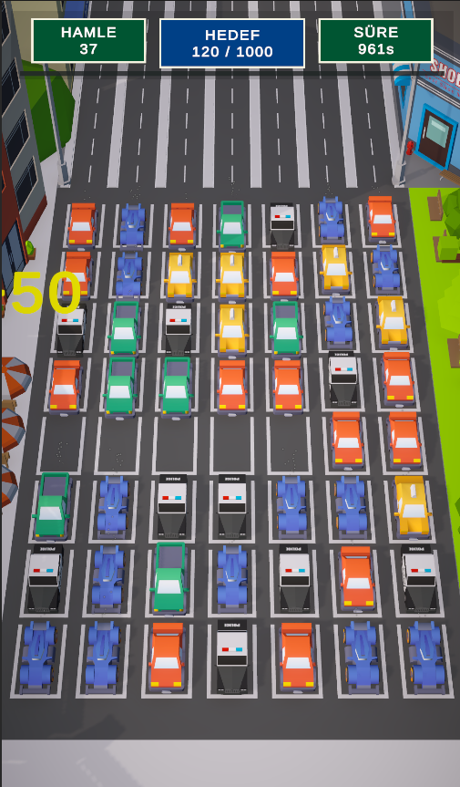

# Grid-Based Traffic Puzzle Mechanic (Unity)

Bu proje, Unity oyun motoru ve C# kullanılarak geliştirilmiş, ızgara (grid) tabanlı bir bulmaca oyunu prototipidir. Projede, nesne yönelimli programlama (OOP) prensipleri kullanılarak sağlam bir oyun mimarisi kurulmuş, Breadth-First Search (BFS) tabanlı algoritmalar ile zincirleme eşleşme mekanikleri geliştirilmiştir.

## Kullanılan Teknolojiler ve Araçlar
*   **Oyun Motoru:** Unity (2022.3+)
*   **Dil:** C#
*   **Render Pipeline:** URP (Universal Render Pipeline) + Post-Processing
*   **Animasyon:** DOTween (Performanslı UI ve Obje animasyonları için)

## Core Mechanics (Temel Mekanikler) ve Mimari
Projenin temelinde yatan mühendislik ve tasarım yaklaşımları şunlardır:

1.  **State Machine (Durum Makinesi) Tasarımı:**
    *   Oyun döngüsü (Game Loop), `GameState` enum'u ile yönetilmektedir (`Spawning`, `WaitingForInput`, `Processing`).
    *   Bu yapı, grid üzerinde işlem yapılırken (örneğin arabalar yer değiştirirken veya patlarken) oyuncu girdisini bloke ederek oyunun kararlı (stable) çalışmasını sağlar.

2.  **Grid ve Slot Yönetimi (Dinamik Matris Sistemi):**
    *   Sahnedeki otopark alanı, kod üzerinden dinamik olarak taranıp `SlotData` ve `Lane` (Şerit) sınıflarıyla iki boyutlu bir matris olarak bellekte tutulmaktadır.
    *   Bu sayede bölüm (Level) tasarımlarında satır/sütun sayıları kolayca değiştirilebilir; belirli slotlar `isBlocked` parametresi ile kullanıma kapatılarak engel eklenebilir.

3.  **Kümeleme (Clustering) ve Eşleştirme Algoritması:**
    *   Grid üzerindeki arabaların eşleşmelerini tespit etmek için `Queue` ve `HashSet` kullanılarak bellek dostu bir **BFS (Breadth-First Search)** arama algoritması (`GetCluster`) uygulanmıştır.
    *   Bu algoritma, komşu düğümleri (arabaları) tarayarak 5'li eşleşmeleri bulur ve sonsuz döngüleri (infinite loop) engeller.

4.  **Juiciness (Oyun Hissiyatı) ve UX Geliştirmeleri:**
    *   Eşleşen arabalar standart `Destroy()` ile silinmek yerine, **DOTween** kullanılarak yumuşak bir ölçeklendirme (Scale) ile yok olmaktadır.
    *   Patlama anında **Camera Shake (Kamera Sarsıntısı)** efekti uygulanarak tokluk hissi artırılmıştır.
    *   **Floating Text (Kayan Yazı):** Eşleşme anında dinamik olarak ekranda beliren TextMeshPro tabanlı skor yazıları, DOTween ile kameraya hizalanarak süzülür ve kaybolur.
    *   **Görsel Kalite:** Unity URP üzerinden Color Grading ve Bloom efektleri kullanılarak Low Poly materyallerin daha canlı ve modern (Hypercasual tarzı) görünmesi sağlanmıştır.